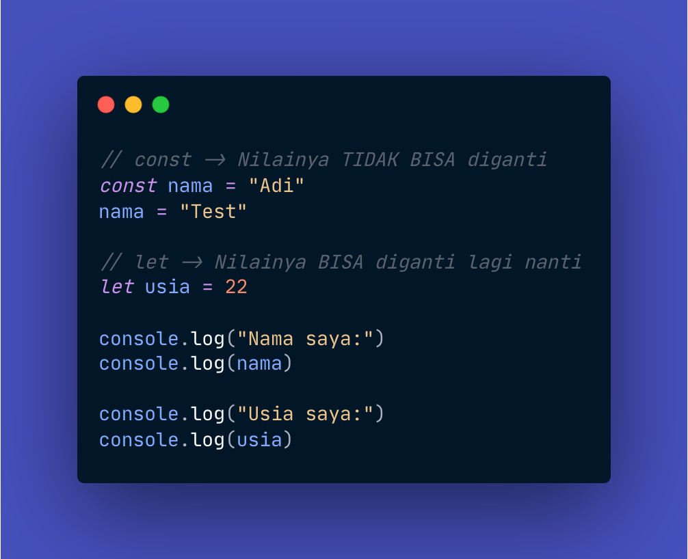
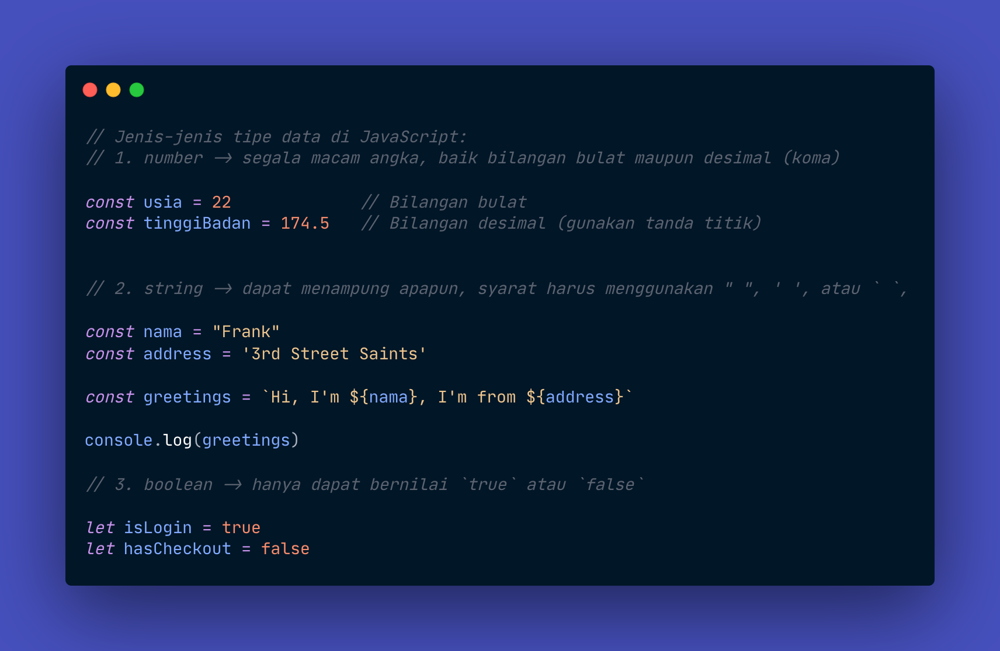
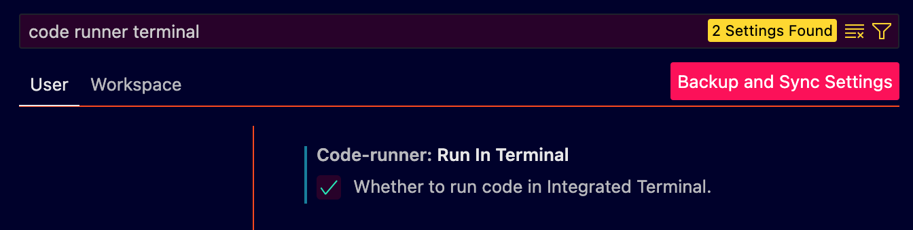
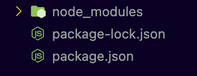
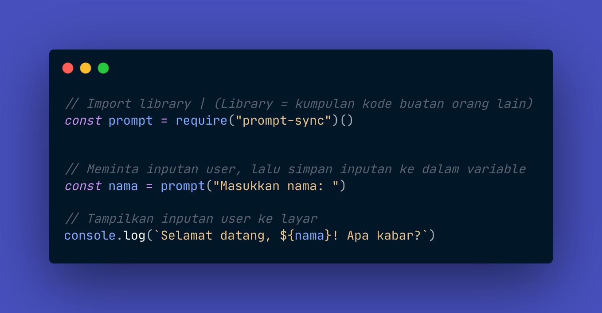
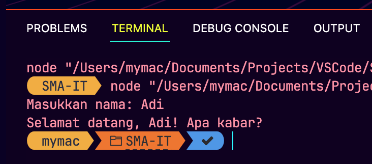

# Pertemuan 2

## Variable

*Variable* dalam bahasa pemrograman *JavaScript* adalah wadah untuk menyimpan data.

Ada dua cara yang disarankan untuk membuat variabel dalam JavaScript, yaitu menggunakan `const` dan `let`.

Langsung saja kita coba! Buatlah *file* baru di dalam folder `Pertemuan2` bernama `Variable.js`, lalu tulis dan jalankan kode berikut:



**Pro Tip:** Gunakan kombinasi tombol *shortcut* `[Ctrl] + [Alt] + [N]` (atau `[Control ⌃] + [Option ⌥] + [N]` untuk pengguna MacOS) untuk menjalankan kode.

**Penjelasan:**

* `const`: Digunakan untuk mendeklarasikan variabel yang nilai nya __TIDAK__ dapat diubah (konstan).

* `let`: Digunakan untuk mendeklarasikan variabel yang nilai nya dapat diubah lagi nantinya.


## Tipe Data

Tipe data dalam *JavaScript* adalah tipe data yang menentukan data tipe apa yang dapat ditampung dalam sebuah *variable*. Beberapa di antaranya adalah:

1. **Number:** Tipe data untuk angka, baik bilangan bulat maupun desimal. Contoh:

```JavaScript
let angka = 10;
```

2. **String:** Tipe data yang dapat menampung apapun. Harus diapit oleh tanda `" "`, `' '`, atau ` `` `. Contoh:

```JavaScript
let teks = "Hello, world!"
```

3. **Boolean:** Tipe data yang hanya dapat menampung nilai `true` atau `false`. Contoh:

```JavaScript
let isHujan = true
```

4. **Null:** Tipe data ini menandakan bahwa sebuah variable tidak sedang menampung nilai apa-apa di dalamnya.

```JavaScript
let pacar = null
```

5. **Undefined:** Tipe data ini menandakan bahwa *variable* tertentu belum pernah dibuat sebelumnya.

Sekarang, buatlah file baru bernama `TipeData.js`, lalu tulis dan jalankan kode berikut:




## *Menerima User* Input Melalui `Prompt-Sync`

### Konfigurasi Terminal VSCode

Sebelum melanjutkan ke materi berikutnya, alangkah baiknya kita pergi ke pengaturan Visual Studio Code terlebih dahulu.

**Pro tip:** Untuk mengakses pengaturan dengan cepat, tekan `[Ctrl] + [,]` (atau `[Command ⌘] + [,]` untuk pengguna MacOS).

Setelah itu, lakukan pencarian dengan kata kunci "code runner terminal," lalu centang pilihan yang ada.




### Instalasi *Library* `Prompt-Sync` Menggunakan

Setelah itu, untuk dapat menerima *input* dari *user*, kita perlu menginstall sebuah *library* terlebih dahulu.

1. Buka Terminal kalian. Gunakan `[Ctrl] + [J]` (atau `[Command ⌘] + [J]` untuk pengguna MacOS) untuk membuka bottom bar di VSCode kalian. Pastikan kalian berada di *tab* Terminal, bukan *tab* yang lain.


2. Ketikkan perinta berikut ke dalam Terminal:

```zsh
npm install prompt-sync
```

3. Tunggu hingga proses selesai. Jika sudah, akan ada folder baru di dalam *project* kita seperti berikut:



**Keterangan:** *Icon* mungkin akan terlihat berbeda jika Anda tidak menginstall ekstensi *Material Icons*.

### Cara Menggunakan `Prompt-Sync`

Untuk menggunakan sebuah *library*, kita akan menggunakan yang fungsi `require()`, yang mana nama *library* yang akan kita gunakan kita tulis di dalam `()` tersebut.

Langsung saja kita praktikkan, buat *file* baru di dalam folder `Pertemuan2` bernama `Input.js`, lalu tulis kode berikut:



Sekarang, coba ketikkan sesuatu di terminal, lalu tekan `[Enter ⏎]`. Berikut adalah contoh *output* Terminal saat kode di atas dijalankan:

