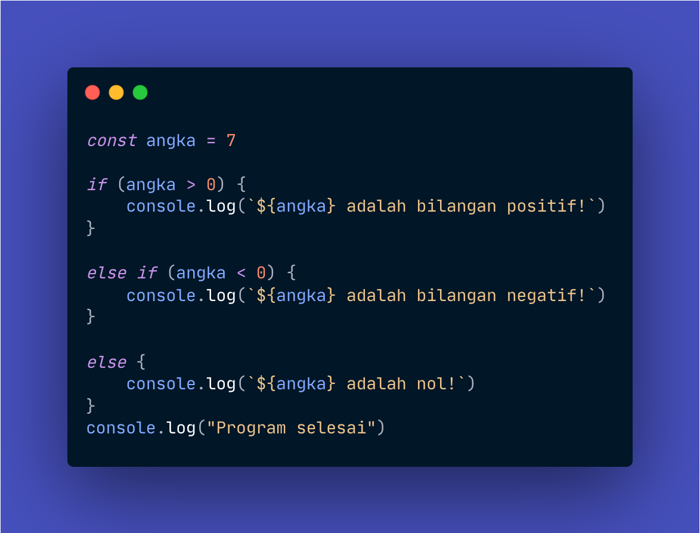
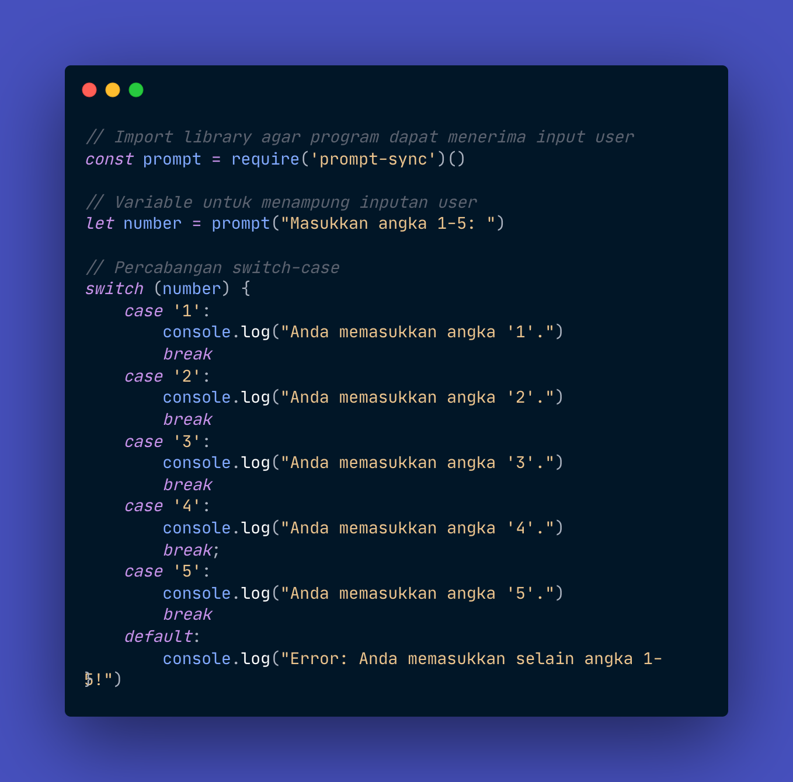

# Pertemuan 3

## Percabangan

Dalam bahasa pemrograman, termasuk bahasa *JavaScript*, ada sebuah konsep penting yang wajib kita ketahui, yakni konsep Percabangan.

Percabangan dalam pemrograman mirip dengan membuat keputusan dalam kehidupan sehari-hari. Misalnya, jika hujan, kita memutuskan untuk membawa payung. Jika tidak, kita tidak perlu membawa payung. Ini adalah contoh sederhana dari percabangan.

Dalam JavaScript, kita menggunakan if, else if, dan else untuk membuat percabangan.

```JavaScript
if (kondisi) {
    // Apa yang terjadi jika kondisi terpenuhi
}

else if (kondisi2) {
    // Apa yang terjadi jika kondisi2 terpenuhi (Opsional)
}

else {
    // Apa yang terjadi jika kondisi di atasnya TIDAK ADA yang terpenuhi (Opsional)
}
```

**Penjelasan:**

1. `if (kondisi) {}`: Ini seperti berkata, "jika kondisi ini benar, lakukan sesuatu". Misalnya, "jika hujan, bawa payung".

2. `else if (kondisi2) {}`: Ini digunakan jika kita memiliki kondisi lain setelah if. Misalnya: "Jika tidak hujan tapi berawan, tidak perlu bawa payung, tapi bawa jaket".

3. `else {}`: Ini digunakan jika tidak ada kondisi yang terpenuhi dari `if` atau `else if` di atasnya. Sebagai contoh: "Jika cuaca cerah, tidak perlu bawa apa-apa".

4. Kode di dalam kurung kurawal `{}` setelah `if`, `else if`, atau `else` adalah apa yang akan dijalankan jika kondisinya terpenuhi.

Untuk memulai, buatlah *file* baru di dalam folder `Pertemuan3` bernama `IfElse.js`, lalu tuliskan kode berikut:




## Switch-Case

Selain menggunakan `if`, `else if`, dan `else`, kita juga bisa menggunakan `switch-case` untuk melakukan percabangan. Berikut adalah contoh penggunaannya:

```JavaScript
switch (variabel) {
    case nilai1:
        // Apa yang terjadi jika variabel sama dengan nilai1

        break;  // <- Wajib ada
    case nilai2:
        // Apa yang terjadi jika variabel sama dengan nilai2

        break;  // <- Wajib ada
    default:
        // Apa yang terjadi jika variabel tidak sama dengan nilai1 atau nilai2
}
```
Dalam switch-case, kita membandingkan sebuah variabel dengan beberapa nilai. Jika variabel sama dengan salah satu nilai, maka blok kode yang sesuai akan dijalankan. Jika tidak ada nilai yang cocok, maka blok kode dalam default akan dijalankan.

Buatlah file baru bernama `SwitchCase.js`, lalu tulis kode berikut:



## Perbedaan If-Else vs Switch-Case

Mari kita bahas perbedaan antara pernyataan `if-else` dan `switch-case` dalam *JavaScript*.

1. `If-Else`: Ini adalah pernyataan kondisional yang menjalankan satu set kode jika kondisi tertentu benar. Jika kondisi tersebut salah, set kode lain dapat dijalankan. If-else paling baik digunakan ketika ada beberapa kondisi yang harus diperiksa.

```JavaScript
let buah = "apel"

if (buah === "hujan")
    console.log("Pisang berwarna kuning.")
else if (buah === "cerah")
    console.log("Apel bisa berwarna merah, hijau, atau kuning.")
else
    console.log("Saya tidak tahu warna buah itu.")
```

2. `Switch-Case`: Ini adalah jenis pernyataan kondisional yang mengevaluasi persamaan nilai sebuah *variable*. Setelah *case* yang cocok ditemukan, blok kode pada *case* tersebut akan dijalankan. `Switch-case` paling baik digunakan ketika ada satu kondisi yang harus diperiksa terhadap beberapa nilai yang mungkin.

```JavaScript
let buah = "apel"

switch (buah) {
    case "pisang":
        console.log("Pisang berwarna kuning.")
        break
    case "apel":
        console.log("Apel bisa berwarna merah, hijau, atau kuning.")
        break
    default:
        console.log("Saya tidak tahu warna buah itu.")
}
```